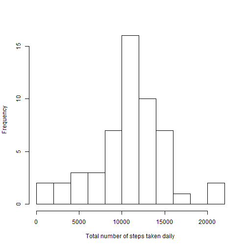
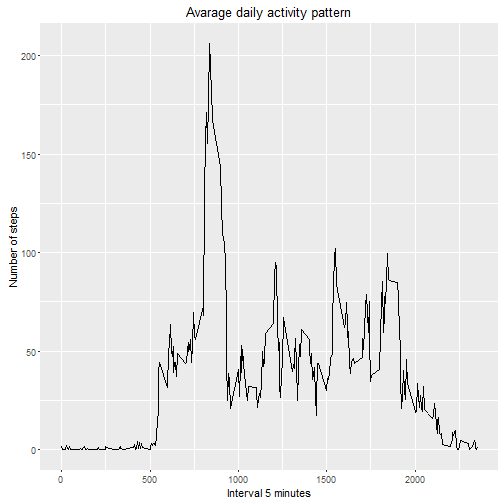
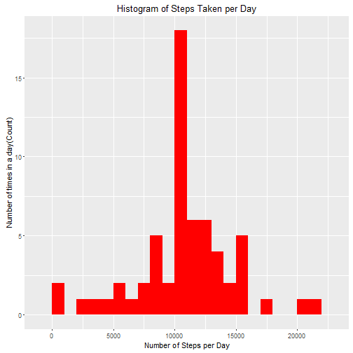
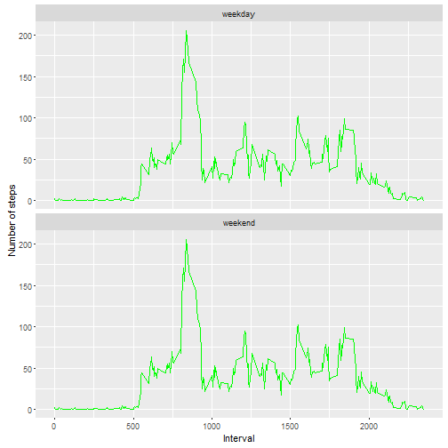

Introduction
============
This document presents the results of course Project 1, of Reproducible Research in the Data Scientists spesialisation. This assaignment uses data from a personal acitity monitoring device. The device collects data (steps taken) at 5 minuts intervals through out the day. There is data for 2 months from an anonymous individual, collectet during October and November 2012. 

This report uses a singel Rmarkdown document that can be processed by knitr and be transformed into an HTML file. 

Preparing the R environment
===========================
Getting the necessary libaryes to running the script. 

```r
library(knitr)
library(ggplot2)
```


Loading and preparing the data
==============================
The first part of the assigment is to show any code that is needed to;

1 Load the data (i.e. read.csv())

2 Process/transform the data (if necessary) into a format suitable for your analysis

The data are in the cloned reposetroy. It can also be downloaded from the  website. 
https://d396qusza40orc.cloudfront.net/repdata%2Fdata%2Factivity.zip.

###Loading the data
Notis; it is assumed that the activity.csv is in the current working directory. 


```r
    A <-read.csv("activity.csv",header=TRUE, sep =",", 
    colClasses = c("numeric", "character", "numeric"))
```

###Prepearing the data and viewing the data set
Converting date colum to Date class and interval colum to Factor class.

```r
    A$date <- as.Date(A$date, format ="%Y-%m-%d")
    A$interval <- as.factor(A$interval)
      head(A)
```

```
##   steps       date interval
## 1    NA 2012-10-01        0
## 2    NA 2012-10-01        5
## 3    NA 2012-10-01       10
## 4    NA 2012-10-01       15
## 5    NA 2012-10-01       20
## 6    NA 2012-10-01       25
```

```r
      str(A)
```

```
## 'data.frame':	17568 obs. of  3 variables:
##  $ steps   : num  NA NA NA NA NA NA NA NA NA NA ...
##  $ date    : Date, format: "2012-10-01" "2012-10-01" ...
##  $ interval: Factor w/ 288 levels "0","5","10","15",..: 1 2 3 4 5 6 7 8 9 10 ...
```

```r
      summary(A)
```

```
##      steps             date               interval    
##  Min.   :  0.00   Min.   :2012-10-01   0      :   61  
##  1st Qu.:  0.00   1st Qu.:2012-10-16   5      :   61  
##  Median :  0.00   Median :2012-10-31   10     :   61  
##  Mean   : 37.38   Mean   :2012-10-31   15     :   61  
##  3rd Qu.: 12.00   3rd Qu.:2012-11-15   20     :   61  
##  Max.   :806.00   Max.   :2012-11-30   25     :   61  
##  NA's   :2304                          (Other):17202
```

What is the mean total number of steps taken per day
===================================================
For this part of the assignment, we can ignore the missing values in the dataset.

1 Calculate the total number of steps taken per day
   
2 Make a histogram of the total number of steps taken each day

3 Calculate and report the mean and median of the total number of steps taken per day


If one were to remove the missing values the code below will do so. 

```r
    AIgnoreNa <- na.omit(A)
      str(AIgnoreNa)
```

```
## 'data.frame':	15264 obs. of  3 variables:
##  $ steps   : num  0 0 0 0 0 0 0 0 0 0 ...
##  $ date    : Date, format: "2012-10-02" "2012-10-02" ...
##  $ interval: Factor w/ 288 levels "0","5","10","15",..: 1 2 3 4 5 6 7 8 9 10 ...
##  - attr(*, "na.action")=Class 'omit'  Named int [1:2304] 1 2 3 4 5 6 7 8 9 10 ...
##   .. ..- attr(*, "names")= chr [1:2304] "1" "2" "3" "4" ...
```

We calculate the total steps per day.

```r
    stepsPerDay <- rowsum(A$steps,format(A$date,'%Y-%m-%d'))
    stepsPerDay <- data.frame(stepsPerDay)
    names(stepsPerDay)<- ("steps")
    head(stepsPerDay)
```

```
##            steps
## 2012-10-01    NA
## 2012-10-02   126
## 2012-10-03 11352
## 2012-10-04 12116
## 2012-10-05 13294
## 2012-10-06 15420
```

Then we make a histogram of the total number of steps taken per day.

```r
    hist(stepsPerDay$steps, main = "", breaks = 10, xlab="Total number of steps taken daily")
```



To complete this part we calulate the mean an median of number of steps taken per day.    

```r
    mean(stepsPerDay$steps, na.rm=TRUE)
```

```
## [1] 10766.19
```

```r
    median(stepsPerDay$steps, na.rm = TRUE)
```

```
## [1] 10765
```
The mean is 10766.19 and the median is 10765.     

What is the average daily activity pattern
===========================================

1 Make a time series plot (i.e. type = "l") of the 5-minute interval (x-axis) and the average number 
of steps taken, averaged across all days (y-axis)

2 Which 5-minute interval, on average across all the days in the dataset, contains the maximum 
number of steps?


  
We calculate avarege steps of 5-minute interval, during a 24 hour period. The intervals are converted to integrers. 


```r
    stepsPerInterval <- aggregate(A$steps,
                    by=list(interval =A$interval), FUN=mean, na.rm=TRUE)
        stepsPerInterval$interval<- as.integer(levels(stepsPerInterval$interval)[stepsPerInterval$interval])
        colnames(stepsPerInterval)<- c("interval","steps")
```

Then we can make a time series plot that shows the avarage number of steps taken, avaraged accross all days by 5 minut intervals. 

```r
 qplot(x=interval, y=steps, data=stepsPerInterval, geom = "line",
          xlab = "Interval 5 minutes", ylab = "Number of steps",
          main = "Avarage daily activity pattern")
```



Then we can find which 5-minute interval, on average across all the days in the dataset, contains the maximum number of steps.

```r
    stepsPerInterval[which.max(stepsPerInterval$steps),]
```

```
##     interval    steps
## 104      835 206.1698
```
206 steps was maximum steps taken in interval 835. 

Imputing missing values
=======================
For this part we are to; 

1 Calculate and report the total number of missing values in the dataset (i.e. the total number of rows with NAs)

2 Devise a strategy for filling in all of the missing values in the dataset. The strategy does not need to be sophisticated. For example, you could use the mean/median for that day, or the mean for that 5-minute interval, etc.

3 Create a new dataset that is equal to the original dataset but with the missing data filled in.

4 Make a histogram of the total number of steps taken each day and Calculate and report the mean and median total number of steps taken per day. 

5 Do these values differ from the estimates from the first part of the assignment? What is the impact of imputing missing data on the estimates of the total daily number of steps?


  
We start by getting an overview of how many missing values there are in the dataset. 

```r
    missing_vals <- sum(is.na(A$steps))
    str(missing_vals)
```

```
##  int 2304
```
The total number of missing values are 2304. 

###Repleacing missing values
We now crate a function that fills in the missing values. I have choosen to replace missing values with the mean value at the same intervall acrosse days. 

```r
    narep <- function(data, pervalue) {
      na_index <- which(is.na(data$steps))
      na_replace <- unlist(lapply(na_index, FUN=function(idx){
        interval = data[idx,]$interval
        pervalue[pervalue$interval == interval,]$steps
      }))
      fill_steps <- data$steps
      fill_steps[na_index] <- na_replace
      fill_steps
    }
    
    ARep <- data.frame(  
      steps = narep(A, stepsPerInterval),  
      date = A$date,  
      interval = A$interval)
    str(ARep)
```

```
## 'data.frame':	17568 obs. of  3 variables:
##  $ steps   : num  1.717 0.3396 0.1321 0.1509 0.0755 ...
##  $ date    : Date, format: "2012-10-01" "2012-10-01" ...
##  $ interval: Factor w/ 288 levels "0","5","10","15",..: 1 2 3 4 5 6 7 8 9 10 ...
```

```r
    missing_vals_ny <- sum(is.na(ARep$steps))
    sum(is.na(ARep$steps))
```

```
## [1] 0
```
  As we see from the output there are no more missing values. 

###Making the histogram  
Below we make a histogram of total number of steps taken each day with missing values being repleaced. 

First we aggregate steps per day with the new dataset. 

```r
    stepsPerDayRep <- aggregate(steps ~ date, ARep, sum)
    colnames(stepsPerDayRep) <- c("date","steps")
    head(stepsPerDayRep)
```

```
##         date    steps
## 1 2012-10-01 10766.19
## 2 2012-10-02   126.00
## 3 2012-10-03 11352.00
## 4 2012-10-04 12116.00
## 5 2012-10-05 13294.00
## 6 2012-10-06 15420.00
```
    
Then we make a histogram of the daily total number of steps taken. 

```r
    ggplot(stepsPerDayRep, aes(x = steps)) +
      geom_histogram(fill = "red", binwidth = 1000)+
      labs(title="Histogram of Steps Taken per Day", 
           x = "Number of Steps per Day", y = "Number of times in a day(Count)") 
```



```r
    steps_mean_fill   <- mean(stepsPerDayRep$steps)
    steps_median_fill <- median(stepsPerDayRep$steps)
```
The mean is not alterd at all by the imputations versus the median has gone down by a little over 1 step a day.Conclusion; no change in mean or median. 


Are there differences in activity patterns between weekdays and weekends
========================================================================
For this part we will use the dataset which has the missing vaules filled in by imputation and we will use the weekdays()function as sugesseted. 

1 Create a new factor variable in the dataset with two levels - "weekday" and "weekend" 
indicating whether a given date is a weekday or weekend day.

2 Make a panel plot containing a time series plot (i.e. type = "l") of the 5-minute interval 
(x-axis) and the average number of steps taken, averaged across all weekday days or weekend days            (y-axis). See the README file in the GitHub repository to see an example of what this plot should look like using simulated data.
 


Using the dataset where missing values have been substitude and crating a new variabel, stepsInterval.  
 

```r
  stepsInterval <- function(data) {
      stepsInterval <- aggregate(ARep$steps, by=list(interval = ARep$interval),
                          FUN=mean, na.rm=T)
   
      stepsInterval$interval <- as.integer(levels(stepsInterval$interval)[stepsInterval$interval])
      colnames(stepsInterval) <- c("interval", "steps")
      stepsInterval
}
```

Subseting the data into either weekend or weekday. 


```r
    daysGrouped<- function(data) {
      data$weekday <- 
            as.factor(weekdays(data$date)) 
      weekenddata <- subset(data, weekday %in% c("Saturday","Sunday"))
      weekdaydata <- subset(data, !weekday %in% c("Saturday","Sunday"))

      stepsWeekend <- stepsInterval(weekenddata)
      stepsWeekday <- stepsInterval(weekdaydata)

      stepsWeekend$dayofweek <- rep("weekend", nrow(stepsWeekend))
      stepsWeekday$dayofweek <- rep("weekday", nrow(stepsWeekday))

      daysGrouped <- rbind(stepsWeekend, stepsWeekday)
      daysGrouped$dayofweek <- as.factor(daysGrouped$dayofweek)
      daysGrouped
}

      daysGroupedComplete <- daysGrouped(ARep) 
      str(daysGroupedComplete)
```

```
## 'data.frame':	576 obs. of  3 variables:
##  $ interval : int  0 5 10 15 20 25 30 35 40 45 ...
##  $ steps    : num  1.717 0.3396 0.1321 0.1509 0.0755 ...
##  $ dayofweek: Factor w/ 2 levels "weekday","weekend": 2 2 2 2 2 2 2 2 2 2 ...
```

Plotting the persons average activity on weekends and weekdays. 

```r
    ggplot(daysGroupedComplete, aes(x=interval, y=steps))+ 
        geom_line(color="green")+ 
        facet_wrap(~ dayofweek, nrow=2, ncol=1)+
        labs(x="Interval", y="Number of steps") 
```



In conclusion the person seems to be more activ in the weekend compared to the weekdays.

